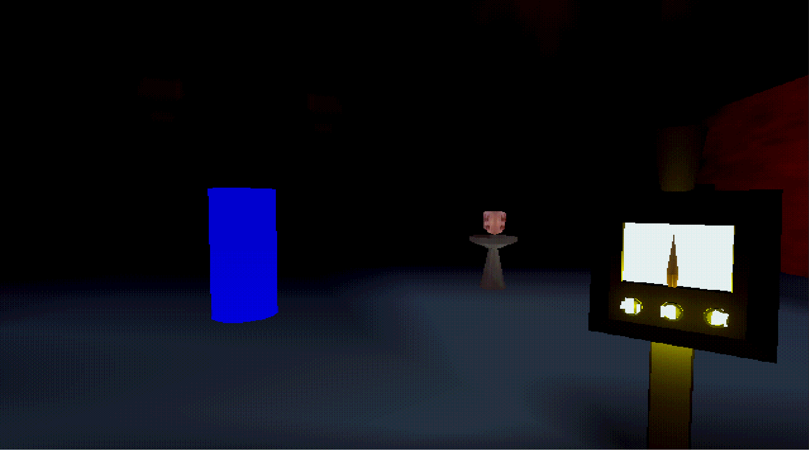

# VoxMachina
Survival horror game made in 72 hours for Ludum Dare 48 Game Jam.
Theme: Deeper and Deeper

Follow the future development of this title on [Itch.io](https://mwahba13.itch.io/vox-machina)

## Controls

W,A,S,D - Move

Left Mouse Button - Create Low (Red) Sounds

Right Mouse Button - Create High (Green) Sounds

## Credits 

Sound -  Christopher William McEwen

Art -  Jordan Jenkins

Code - Michael Wahba
